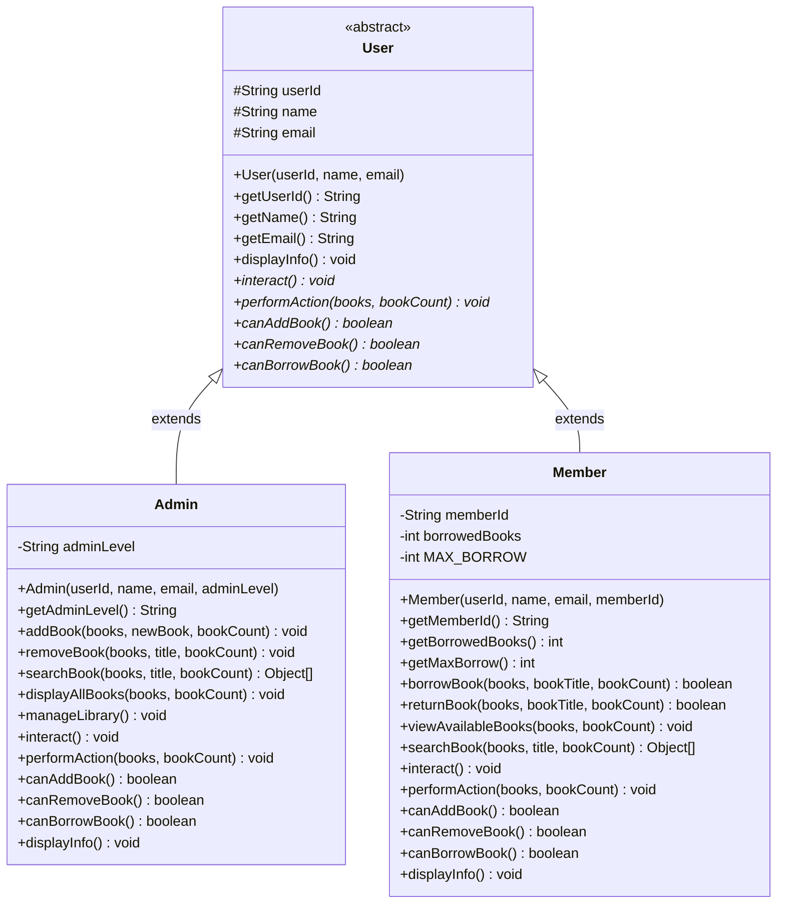

# Dokumentasi Konsep Object-Oriented Programming (OOP)
## Sistem Manajemen Perpustakaan

### 📚 Daftar Isi
1. [Pendahuluan](#pendahuluan)
2. [Konsep OOP yang Diterapkan](#konsep-oop-yang-diterapkan)
3. [Implementasi Inheritance](#implementasi-inheritance)
4. [Implementasi Polymorphism](#implementasi-polymorphism)
5. [Implementasi Abstraction](#implementasi-abstraction)
6. [Implementasi Encapsulation](#implementasi-encapsulation)
7. [Class Diagram](#class-diagram)
8. [Analisis dan Kesimpulan](#analisis-dan-kesimpulan)

---

## 1. Pendahuluan

Sistem Manajemen Perpustakaan ini dirancang menggunakan paradigma Object-Oriented Programming (OOP) untuk menciptakan struktur kode yang modular, maintainable, dan scalable. Sistem ini mengelola interaksi antara berbagai jenis pengguna (Admin dan Member) dengan koleksi buku perpustakaan.

### Tujuan Penerapan OOP:
- **Reusability**: Kode dapat digunakan kembali melalui inheritance
- **Flexibility**: Mudah menambah fitur baru tanpa mengubah kode existing
- **Maintainability**: Struktur kode yang terorganisir dan mudah dipelihara
- **Real-world Modeling**: Merepresentasikan entitas dunia nyata (User, Admin, Member)

---

## 2. Konsep OOP yang Diterapkan

### 2.1 Empat Pilar OOP

1. **Inheritance (Pewarisan)**
   - Mekanisme dimana sebuah class dapat mewarisi properties dan methods dari class lain
   - Mendukung code reusability dan hierarki yang logis

2. **Polymorphism (Polimorfisme)**
   - Kemampuan objek untuk memiliki banyak bentuk
   - Satu interface dapat memiliki multiple implementations

3. **Abstraction (Abstraksi)**
   - Menyembunyikan detail implementasi yang kompleks
   - Menampilkan hanya fitur essential kepada user

4. **Encapsulation (Enkapsulasi)**
   - Membungkus data dan methods dalam satu unit (class)
   - Melindungi data dari akses langsung menggunakan access modifiers

---

## 3. Implementasi Inheritance

### 3.1 Struktur Hierarki Class

```
         User (Abstract Parent Class)
         /                \
        /                  \
    Admin                Member
(Child Class)        (Child Class)
```

### 3.2 Parent Class: User

```java
public abstract class User {
    // Protected attributes - dapat diakses oleh child classes
    protected String userId;
    protected String name;
    protected String email;
    
    // Constructor
    public User(String userId, String name, String email) {
        this.userId = userId;
        this.name = name;
        this.email = email;
    }
}
```

**Penjelasan:**
- `abstract class` menandakan class ini tidak dapat diinstansiasi langsung
- `protected` attributes memungkinkan child classes mengakses langsung
- Constructor menerima parameter untuk inisialisasi attributes

### 3.3 Child Class: Admin

```java
public class Admin extends User {
    private String adminLevel;
    
    public Admin(String userId, String name, String email, String adminLevel) {
        super(userId, name, email); // Memanggil constructor parent
        this.adminLevel = adminLevel;
    }
}
```

**Penjelasan:**
- `extends User` menunjukkan Admin mewarisi dari User
- `super()` memanggil constructor parent class
- Admin menambahkan attribute spesifik: `adminLevel`

### 3.4 Child Class: Member

```java
public class Member extends User {
    private String memberId;
    private int borrowedBooks;
    private final int MAX_BORROW = 3;
    
    public Member(String userId, String name, String email, String memberId) {
        super(userId, name, email);
        this.memberId = memberId;
        this.borrowedBooks = 0;
    }
}
```

**Penjelasan:**
- Member mewarisi semua attributes dan methods dari User
- Menambahkan attributes spesifik: `memberId`, `borrowedBooks`, `MAX_BORROW`
- Konstanta `MAX_BORROW` membatasi jumlah peminjaman

### 3.5 Keuntungan Inheritance

1. **Code Reusability**
   - Attributes umum (userId, name, email) tidak perlu ditulis ulang
   - Methods umum dapat digunakan oleh semua child classes

2. **Maintainability**
   - Perubahan di parent class otomatis berlaku untuk child classes
   - Mengurangi duplikasi kode

3. **Logical Hierarchy**
   - Struktur class mencerminkan hubungan real-world
   - Mudah dipahami dan dikembangkan

---

## 4. Implementasi Polymorphism

### 4.1 Method Overriding

Polymorphism diterapkan melalui method overriding, dimana child classes memberikan implementasi spesifik untuk abstract methods.

#### Abstract Methods di User Class:

```java
public abstract class User {
    // Abstract methods - harus diimplementasi oleh child classes
    public abstract void interact();
    public abstract void performAction(Object[] books, int[] bookCount);
    public abstract boolean canAddBook();
    public abstract boolean canRemoveBook();
    public abstract boolean canBorrowBook();
}
```

#### Implementasi di Admin Class:

```java
@Override
public void interact() {
    System.out.println("=== Admin Interface ===");
    System.out.println("Admin " + name + " dapat:");
    System.out.println("1. Menambah buku");
    System.out.println("2. Menghapus buku");
    System.out.println("3. Mencari buku");
    System.out.println("4. Melihat semua buku");
    System.out.println("5. Mengelola perpustakaan");
}

@Override
public boolean canAddBook() {
    return true; // Admin dapat menambah buku
}

@Override
public boolean canRemoveBook() {
    return true; // Admin dapat menghapus buku
}

@Override
public boolean canBorrowBook() {
    return false; // Admin tidak perlu meminjam buku
}
```

#### Implementasi di Member Class:

```java
@Override
public void interact() {
    System.out.println("=== Member Interface ===");
    System.out.println("Member " + name + " dapat:");
    System.out.println("1. Meminjam buku");
    System.out.println("2. Mengembalikan buku");
    System.out.println("3. Melihat buku tersedia");
    System.out.println("4. Mencari buku");
    System.out.println("5. Melihat riwayat peminjaman");
}

@Override
public boolean canAddBook() {
    return false; // Member tidak dapat menambah buku
}

@Override
public boolean canRemoveBook() {
    return false; // Member tidak dapat menghapus buku
}

@Override
public boolean canBorrowBook() {
    return borrowedBooks < MAX_BORROW; // Member dapat meminjam jika belum limit
}
```

### 4.2 Polymorphic Behavior

```java
// Demonstrasi polymorphism
User[] users = {
    new Admin("A001", "John", "john@lib.com", "Senior"),
    new Member("M001", "Alice", "alice@email.com", "MEM001")
};

// Satu method, behavior berbeda
for (User user : users) {
    user.interact(); // Output berbeda untuk Admin vs Member
    System.out.println("Can add book: " + user.canAddBook());
}
```

**Output:**
- Admin akan menampilkan menu admin dan `canAddBook() = true`
- Member akan menampilkan menu member dan `canAddBook() = false`

### 4.3 Keuntungan Polymorphism

1. **Flexibility**
   - Satu interface dapat memiliki multiple implementations
   - Mudah menambah user type baru (misal: Librarian)

2. **Code Extensibility**
   - Dapat menambah behavior baru tanpa mengubah existing code
   - Mendukung Open/Closed Principle

3. **Dynamic Behavior**
   - Behavior ditentukan saat runtime berdasarkan object type
   - Memungkinkan dynamic dispatch

---

## 5. Implementasi Abstraction

### 5.1 Abstract Class User

```java
public abstract class User {
    // Abstract class menyembunyikan implementasi detail
    // Child classes yang menentukan implementasi spesifik
    
    // Concrete method - implementasi umum
    public void displayInfo() {
        System.out.println("User ID: " + userId);
        System.out.println("Name: " + name);
        System.out.println("Email: " + email);
    }
    
    // Abstract methods - implementasi diserahkan ke child
    public abstract void interact();
}
```

### 5.2 Keuntungan Abstraction

1. **Simplicity**
   - User tidak perlu tahu detail implementasi
   - Focus pada apa yang dilakukan, bukan bagaimana

2. **Flexibility**
   - Implementasi dapat berubah tanpa affect interface
   - Mendukung loose coupling

3. **Security**
   - Menyembunyikan kompleksitas internal
   - Mengurangi dependencies

---

## 6. Implementasi Encapsulation

### 6.1 Access Modifiers

```java
public class Admin extends User {
    private String adminLevel;        // Private - hanya accessible dalam class
    
    // Public getter - controlled access
    public String getAdminLevel() {
        return adminLevel;
    }
    
    // No setter - adminLevel tidak dapat diubah setelah inisialisasi
}

public class Member extends User {
    private int borrowedBooks;        // Private field
    
    // Public method untuk modify dengan validasi
    public boolean borrowBook(Object[] books, String bookTitle, int bookCount) {
        if (borrowedBooks < MAX_BORROW) {
            borrowedBooks++;  // Controlled modification
            return true;
        }
        return false;
    }
}
```

### 6.2 Information Hiding

```java
public abstract class User {
    protected String userId;    // Protected - accessible by subclasses
    protected String name;      // Tidak public untuk prevent direct access
    protected String email;
    
    // Public getters untuk controlled access
    public String getUserId() { return userId; }
    public String getName() { return name; }
    public String getEmail() { return email; }
    
    // No setters - data immutable setelah creation
}
```

### 6.3 Keuntungan Encapsulation

1. **Data Protection**
   - Field private/protected mencegah unauthorized access
   - Validasi dapat ditambahkan di methods

2. **Maintainability**
   - Internal changes tidak affect external code
   - Implementation details tersembunyi

3. **Control**
   - Getter/setter memberikan controlled access
   - Business logic dapat di-enforce

---

## 7. Class Diagram



### Notasi Class Diagram:
- `<<abstract>>` : Abstract class
- `+` : Public
- `-` : Private
- `#` : Protected
- `*` : Abstract method
- `<|--` : Inheritance relationship

---

## 8. Analisis dan Kesimpulan

### 8.1 Analisis Penerapan OOP

1. **Inheritance Success**
   - Hierarchy User → Admin/Member mencerminkan real-world relationship
   - Code reuse optimal dengan shared attributes di parent class
   - Easy to extend dengan user type baru

2. **Polymorphism Success**
   - Same interface, different implementations
   - Permission system (canAddBook, etc.) elegant dan extensible
   - Runtime behavior determination bekerja sempurna

3. **Abstraction Success**
   - Complex details hidden dari user
   - Clear separation of concerns
   - Interface stabil meski implementation berubah

4. **Encapsulation Success**
   - Data protected dengan access modifiers
   - Business rules enforced (MAX_BORROW limit)
   - Controlled access melalui methods

### 8.2 Design Patterns Applied

1. **Template Method Pattern**
   - Abstract methods di parent, concrete di child
   - Common algorithm structure, varying implementations

2. **Strategy Pattern (Implicit)**
   - Different strategies untuk user interactions
   - Behavior varies berdasarkan user type

### 8.3 SOLID Principles

1. **Single Responsibility**
   - Each class has one reason to change
   - User handles user data, Admin handles admin operations

2. **Open/Closed**
   - Open for extension (new user types)
   - Closed for modification (existing code stable)

3. **Liskov Substitution**
   - Child classes can replace parent without breaking functionality
   - Polymorphic array User[] works seamlessly

4. **Interface Segregation**
   - Abstract methods focused dan specific
   - No unnecessary methods forced on children

5. **Dependency Inversion**
   - Depend on abstractions (User), not concretes
   - High-level modules independent of low-level

### 8.4 Kesimpulan

Implementasi OOP dalam Sistem Manajemen Perpustakaan ini berhasil menciptakan:

1. **Maintainable Code**
   - Clear structure dan organization
   - Easy to understand dan modify

2. **Extensible Architecture**
   - New features mudah ditambahkan
   - Minimal impact pada existing code

3. **Robust Design**
   - Type safety dengan inheritance
   - Runtime flexibility dengan polymorphism

4. **Real-world Modeling**
   - Classes represent actual entities
   - Behaviors match real operations

Sistem ini mendemonstrasikan best practices OOP dan siap untuk development lebih lanjut dengan solid foundation yang telah dibangun.

---

## 📌 Catatan Implementasi

- Semua source code tersedia di `/src` directory
- Test cases dan examples di `Main.java`
- Untuk menambah user type baru, extend dari User class
- Untuk menambah operations, tambahkan abstract method di User

**Dibuat oleh:** Rizky 